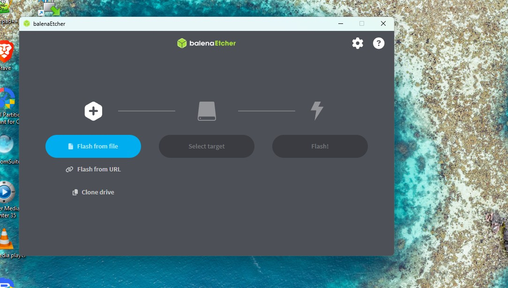
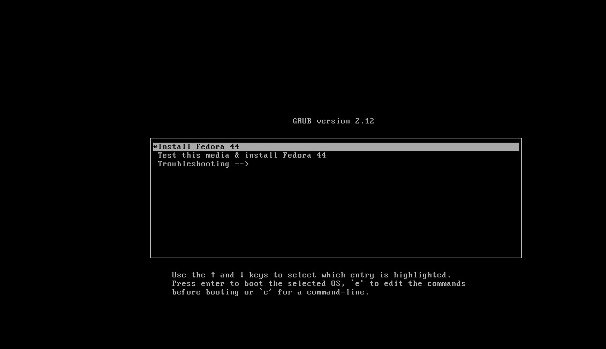
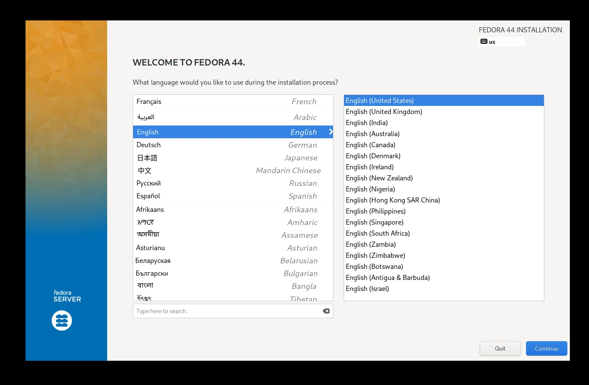
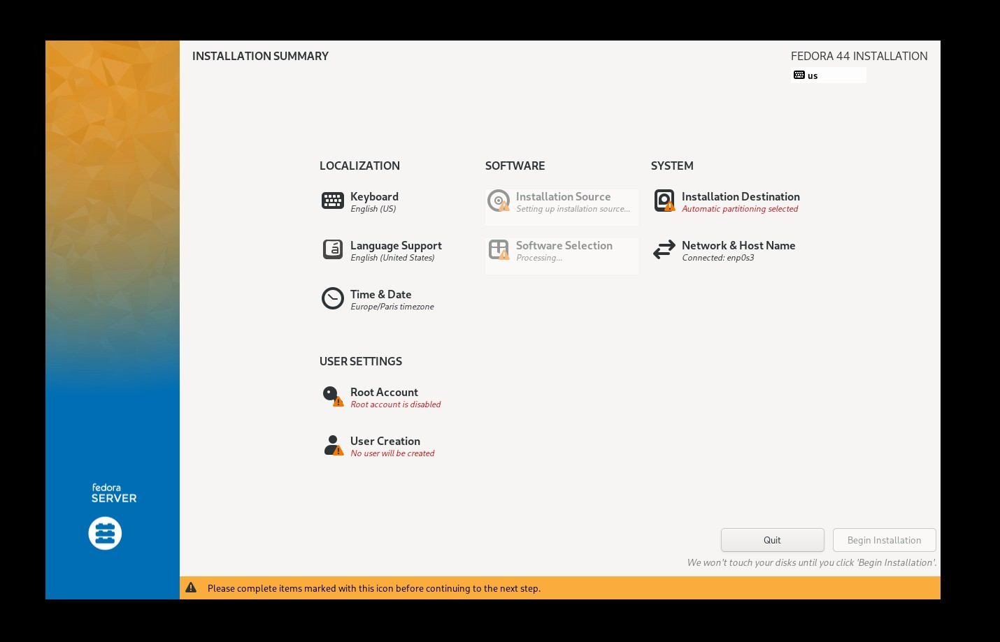
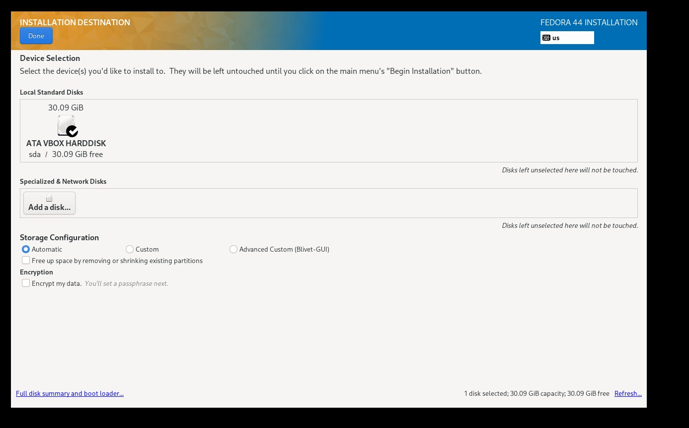
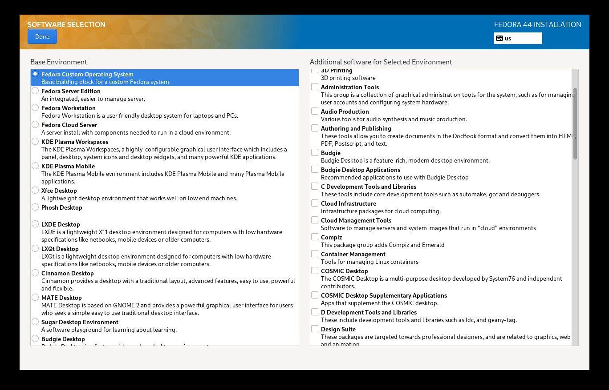
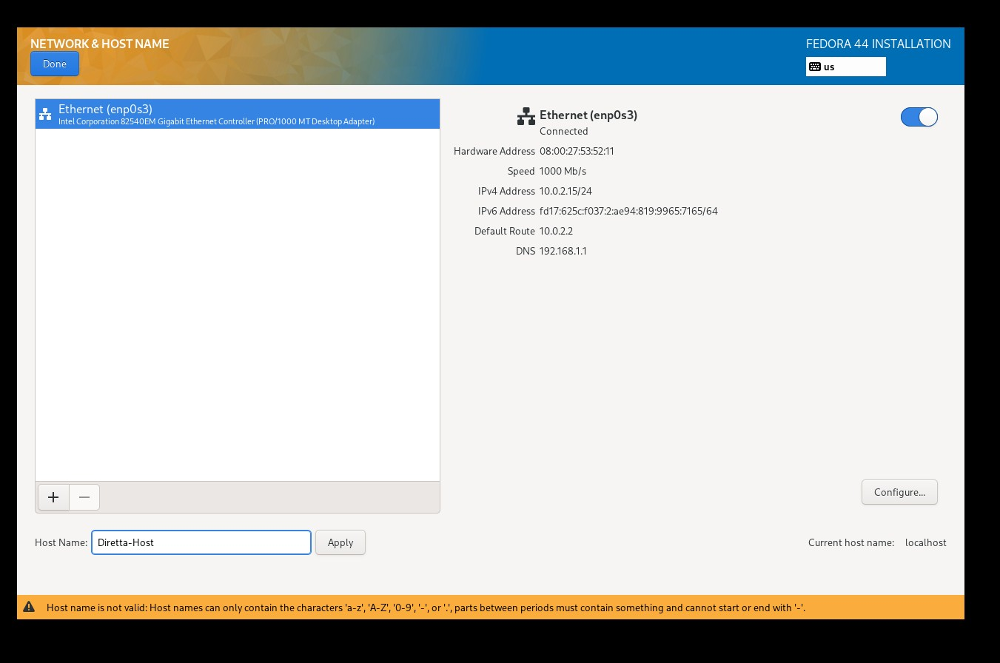
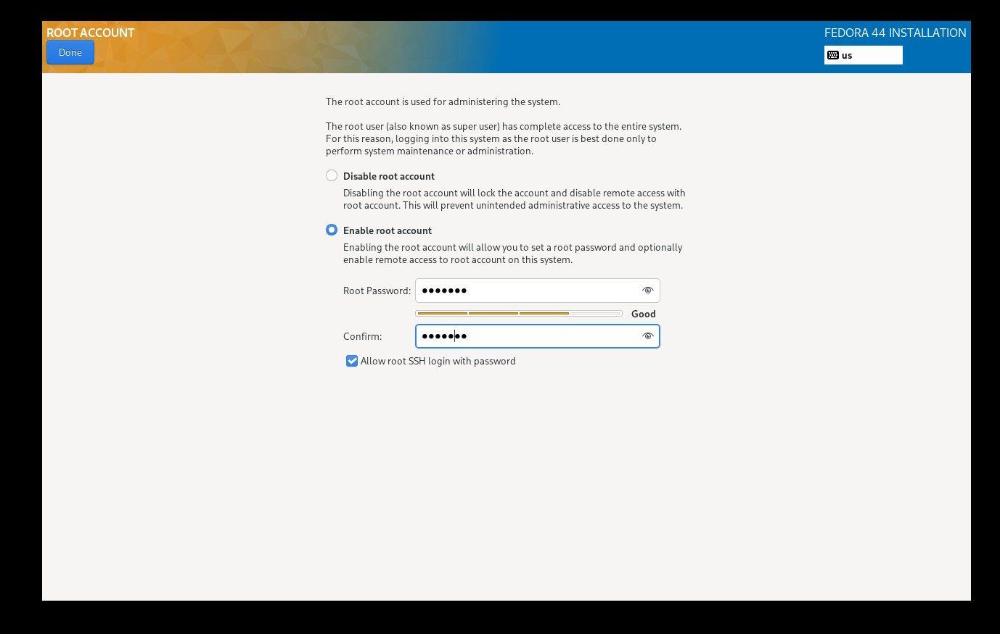
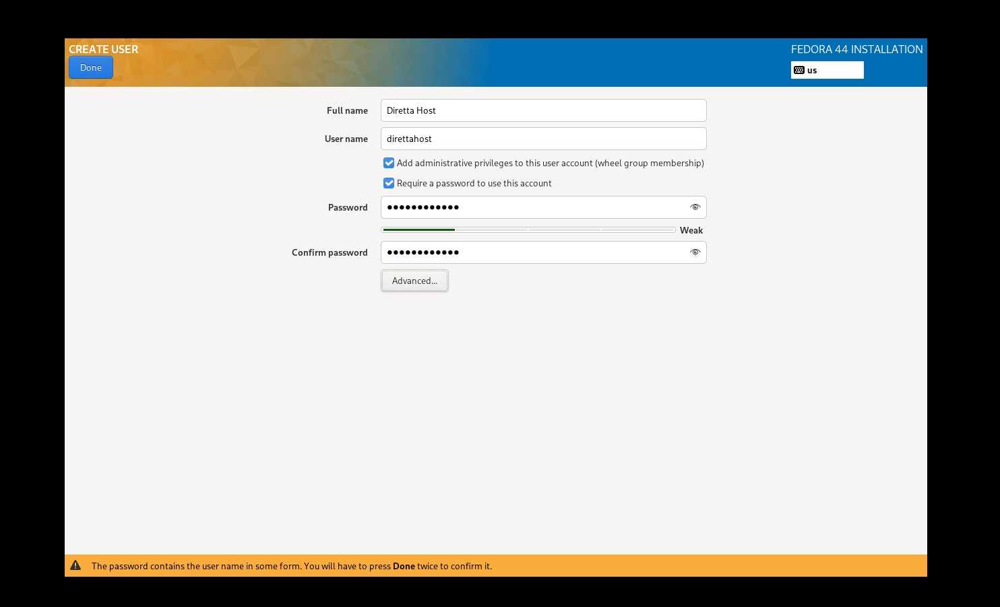

# Newbie Walkthrough — Fedora 43/44 + audiophile setup, from zero

This guide takes you from an empty PC to a fully tuned audiophile playback host running [DirettaRendererUPnP](https://github.com/cometdom/DirettaRendererUPnP) and/or [slim2Diretta](https://github.com/cometdom/slim2Diretta). No prior Linux experience required — every step has the exact command you need to type.

**Time required:** about 2–3 hours total. Most of it is the kernel + FFmpeg + DRUP compilation, which runs unattended.

**What you'll have at the end:** a headless PC or mini-PC dedicated to audio playback, with a real-time kernel, isolated CPU cores, jumbo Ethernet to your Diretta DAC, and an audio renderer (UPnP and/or LMS) that just appears on your network for your control point to drive.

## Table of contents

- [Before you start: prerequisites checklist](#before-you-start-prerequisites-checklist)
- **Part A — at the machine (screen, keyboard, mouse)**
  - [1. Pick the right hardware](#1-pick-the-right-hardware)
  - [2. BIOS settings before booting the installer](#2-bios-settings-before-booting-the-installer)
  - [3. Download the Fedora ISO](#3-download-the-fedora-iso)
  - [4. Create the bootable USB stick](#4-create-the-bootable-usb-stick)
  - [5. Install Fedora minimal](#5-install-fedora-minimal)
  - [6. Note the IP address](#6-note-the-ip-address)
- **Part B — from your couch (SSH)**
  - [7. Connect via SSH](#7-connect-via-ssh)
  - [8. Install host prerequisites](#8-install-host-prerequisites)
  - [9. Download the Diretta SDK](#9-download-the-diretta-sdk)
  - [10. Transfer the SDK to the audio PC](#10-transfer-the-sdk-to-the-audio-pc)
  - [11. Clone the wizard and start it](#11-clone-the-wizard-and-start-it)
  - [12. Walk through the wizard menu](#12-walk-through-the-wizard-menu)
  - [13. Answer the per-module prompts](#13-answer-the-per-module-prompts)
  - [14. Reboot](#14-reboot)
- **Part C — after the reboot**
  - [15. Verify everything is running](#15-verify-everything-is-running)
  - [16. First listening test](#16-first-listening-test)
  - [17. Troubleshooting common issues](#17-troubleshooting-common-issues)
- [Quick reference (TL;DR)](#quick-reference-tldr)

---

## Before you start: prerequisites checklist

You need:

- A **PC or mini-PC** (Intel NUC, small AMD box, etc.) — x86_64, at least 8 GB RAM (16–32 GB recommended) and 30 GB free disk. ARM is not supported by this wizard.
- A **second computer** (your main laptop/desktop) to prepare the USB stick and connect via SSH later.
- A **USB stick**, at least 8 GB. Its contents will be wiped.
- An **Ethernet cable** plugged into your home network — Wi-Fi is not recommended for sustained audio streaming.
- (Optional but recommended for the best Diretta link) **A second NIC** dedicated to the Diretta link — a USB-Ethernet adapter with the **Realtek RTL8156** chipset is the reference choice and is the only way to push MTU up to 16128 (next best is jumbo 9014, which any modern NIC handles).
- A **Diretta target / DAC** on your audio network (this is what the audio PC will stream to).
- The IP address or admin access to your **home router** (to look up the IP of the audio PC later).
- **About 1 hour of patience** during the FFmpeg + DRUP build step in [§13](#13-answer-the-per-module-prompts).

---

# Part A — at the machine

You'll need screen, keyboard, and mouse plugged into the audio PC for this part. After [§6](#6-note-the-ip-address), you can unplug them and finish remotely.

## 1. Pick the right hardware

A typical setup:

- **Audio PC**: small fanless mini-PC. Intel NUC, ASRock DeskMini, Beelink, Minisforum — any modern x86_64 box with at least 4 cores. **8 GB RAM is the bare minimum; 16–32 GB is recommended** (the wizard runs comfortably in 8 GB but headroom helps the kernel page-cache the music stream and keeps any background dnf/update from spilling to disk during playback).
- **Storage**: an internal SSD is plenty — 60–120 GB is more than enough. Music files don't live here; they live on your LMS/Minimserver/Roon server or stream from Qobuz/Tidal...
- **Two NICs (optional but ideal)**: one for your LAN (control points, internet), one for a direct point-to-point link to the Diretta target. For the Diretta link, a **USB-Ethernet adapter with the Realtek RTL8156 chipset** is the reference choice — it's also the only NIC family that supports MTU **16128** (other modern NICs top out at jumbo 9014, which is fine for most setups). Plug it into a **USB 3.0** port (the blue one, or marked "SS"), not USB 2.0. If you have a free PCIe slot in your PC, you can plug in a PCIe NIC with a PCIe NIC with **the realtek RTL8156 chipset**.

Single-NIC setups also work — the wizard handles that case automatically.

## 2. BIOS settings before booting the installer

These choices matter, and some of them can't be changed once the OS is installed. Enter your BIOS / UEFI setup (usually by pressing **F2**, **F12**, **Del**, or **Esc** right after power-on).


- **Secure Boot: OFF** — required. The real-time kernel this wizard installs cannot be signed, so Secure Boot would prevent it from booting.
- **CPU C-states: OFF** (or "C0/C1 only") — prevents the CPU from entering deep sleep that adds latency.
- **CPU SpeedStep / Cool'n'Quiet / P-states: OFF** — keep the CPU at max frequency.
- **CPU Boost (Intel Turbo Boost / AMD Core Performance Boost, named per your BIOS): OFF** — recommended. Module 06 also pins it off at the OS level, but disabling it in the BIOS is more deterministic: the CPU never boosts, not even briefly between power-on and the systemd service starting.
- **Hyper-Threading / SMT: ON** — leave it on; the wizard can disable it at runtime if you want.
- **Virtualization (VT-x / AMD-V): OFF** — not needed for playback.
- **Motherboard audio chip: DISABLED** if you never use it (audio leaves over the network, not via local DAC).
- **Wake-on-LAN, IPMI, server management: OFF** unless you need them.

Save, exit, and let the machine reboot.

> **Going further (optional, after first listening).** Module 06 lets you cap the CPU max frequency from the OS (`/etc/default/audiophile-cpu-states`, `CPU_MAX_PCT=…`) — easy to iterate, restart-and-listen. Once you've found a value you like, you can **consolidate it in the BIOS** via the CPU multiplier / ratio, or via the power limits (`PL1`/`PL2` on Intel, `PPT`/`EDC`/`TDC` on AMD). A BIOS-level limit is strictly more deterministic (the CPU physically can't exceed it, even briefly at boot) and removes the dependency on the runtime service. The OS-level cap stays as a safe playground for further experimentation. Undervolt (`Vcore` offset) is the next step but it's hardware-specific and carries instability risk — proceed only if you're comfortable with it.

## 3. Download the Fedora ISO

On your **main computer** (not the audio PC):

1. Open https://fedoraproject.org/server/download in your browser.
2. Pick **Network Install** (netinst) for **x86_64**.
3. Save the file. The name looks like `Fedora-Server-netinst-x86_64-44-*.iso` (or `-43-` if you deliberately pick Fedora 43 — the wizard supports both).

> Why netinst and not the Live image? The Live image installs a bunch of software you'd just remove afterwards. Netinst lets you start from a truly minimal base.

## 4. Create the bootable USB stick

The easiest cross-platform tool is **balenaEtcher**.

1. Download balenaEtcher from https://etcher.balena.io and install it on your main computer.
2. Plug your USB stick into your main computer.
3. Launch balenaEtcher.
4. Click **Flash from file** → select the Fedora ISO you just downloaded.
5. Click **Select target** → choose your USB stick. **Triple-check this** — it will erase whatever you point at.
6. Click **Flash!** and wait for the operation to finish and verify.



Eject the USB stick cleanly when done.

## 5. Install Fedora minimal

Plug the USB stick into the audio PC, plus screen, keyboard, mouse, and the Ethernet cable to your LAN.

1. Power the audio PC on and immediately press the **boot-menu** key (often **F12**, **F11**, or **Esc** depending on the manufacturer).
2. Pick the USB stick from the boot menu. The Fedora installer (called Anaconda) starts.
3. After a few seconds, the **Welcome to Fedora** screen appears. Click **Install Fedora**.



### 5.1 Language and keyboard

Pick your language (e.g. English (United States)) and keyboard layout. Click **Done**.



You now see the **Installation Summary** — the hub from which you configure each section. You'll come back to this screen between every step below.



### 5.2 Installation destination

Click **Installation Destination**.

- Select the internal SSD (NOT the USB stick — the USB is the installer source).
- Storage configuration: **Automatic**.
- Click **Done**. If prompted to confirm, accept.



### 5.3 Software selection — CRITICAL

Click **Software Selection**.

- Base environment: **Fedora Custom Operating System** (this is the most important step in the whole installer — anything else installs software we'd remove later).
- **Do NOT** tick any add-on group on the right.
- Click **Done**.



### 5.4 Network and hostname

Click **Network & Host Name**.

- Toggle the Ethernet interface to **ON** (it should pick up DHCP from your router).
- Set the hostname to something memorable, e.g. `audio-pc` or `diretta-renderer`.
- Click **Done**.



### 5.5 Root password

Click **Root Password**.

- Tick Enable root account
- Set a strong root password. You won't use it often, but you'll need it for emergencies.
- Tick **Allow root SSH login with password** so you can rescue the box remotely if needed.
- Click **Done**.



### 5.6 User account

Click **User Creation**.

- Full name: anything.
- User name: short and lowercase, e.g. `dommusic`. This is the account you'll use day to day.
- Tick **Make this user administrator** (this puts the user in the `wheel` group and lets them `sudo`).
- Set a password. Click **Done**.



### 5.7 Begin install + reboot

Back on the Installation Summary, click **Begin Installation**.

The installer downloads and writes packages — this takes 5–15 minutes depending on your network. When it's done, click **Reboot System**.

**Pull the USB stick out** while the machine reboots so it doesn't boot the installer again.

After reboot, the machine shows a login prompt. Log in with the **user** account you created (not root).

## 6. Note the IP address

In the terminal:

```bash
ip addr show
```

Look for a line like `inet 192.168.1.104/24` under your Ethernet interface (e.g. `enp5s0`). Write that address down — you'll SSH to it next.

Then make sure SSH is running on the audio PC. While you still have a session on the audio PC (logged in locally), run:

```bash
sudo dnf install -y openssh-server
sudo systemctl enable --now sshd
```
You can now unplug the screen, keyboard, and mouse from the audio PC. Move to your main computer.

---

# Part B — from your couch

Everything from here is done over SSH from your main computer.

## 7. Connect via SSH

From your **main computer** (Terminal on Mac/Linux, PowerShell on Windows 10+):

```bash
ssh dommusic@192.168.1.104
```

Replace `dommusic` with the username you created in [§5.6](#56-user-account) and `192.168.1.104` with the IP from [§6](#6-note-the-ip-address). The first time, type `yes` to accept the host key, then enter the password.

You should see a prompt like `[dommusic@audio-pc ~]$`. You're in.

## 8. Install host prerequisites

A minimal Fedora install ships almost nothing. Update the system and install the few tools the wizard depends on:

```bash
sudo dnf -y update
sudo dnf -y install git curl mokutil grubby dnf-plugins-core tar
```

- `git` is needed to clone the wizard repo (and DRUP, slim2Diretta).
- The others are used by the wizard itself; if you forget any, `00-preflight` will install them as a safety net.

## 9. Download the Diretta SDK

The Diretta Host SDK is required to build DRUP and slim2Diretta. **It must be downloaded by hand** because its licence allows personal use only.

On your **main computer** (not the audio PC):

1. Open https://www.diretta.link/hostsdk.html in your browser.
2. Download the latest **DirettaHostSDK** archive. The filename looks like `DirettaHostSDK_149_8.tar.zst`.

Keep the file in a folder you can find easily — you'll copy it to the audio PC next.

## 10. Transfer the SDK to the audio PC

From your **main computer** (open a new Terminal/PowerShell window — keep your SSH session open in the other one):

```bash
scp ~/Downloads/DirettaHostSDK_149_8.tar.zst dommusic@192.168.1.104:~/
```

Adjust the path, the username, and the IP to match your system. The file copies into the user's home directory on the audio PC.

Then, back in the **SSH session** on the audio PC:

```bash
cd ~
tar --zstd -xf DirettaHostSDK_149_8.tar.zst
ls -d DirettaHostSDK_*
```

You should see a directory named `DirettaHostSDK_149` (or similar) sitting in your home. The wizard auto-detects it from here.

## 11. Clone the wizard and start it

Still in the SSH session:

```bash
cd ~
git clone https://github.com/cometdom/fedora-audiophile-setup.git
cd fedora-audiophile-setup
sudo ./setup.sh
```

The first time you run it, a numbered menu appears.

## 12. Walk through the wizard menu

```
What do you want to do?

   1) Full install              all modules in order (recommended)
   2) 00 preflight            — verify hard pre-conditions...
   3) 01 kernel-rt            — install the PREEMPT_RT kernel...
   ...
  14) 99 finalize             — sanity-check + offer reboot
  15) Exit

Choose [1]:
```

Just press **Enter** (or type `1`). The wizard runs every module in order. You'll be asked questions along the way — the next section explains each one.

> **Reading the menu.** Each module row shows two numbers: the leading **`2)`, `3)`, …** is the menu choice (what you type), and the two digits right after — **`00`, `01`, …, `99`** — are the module number, matching `modules/NN-name.sh` and the references used in §13 below and elsewhere in the docs. The two differ because the menu has extra entries (Full install, Exit) that aren't modules. When the walkthrough says "module 06", look for `06` on the row, not for choice `6`.

> If you ever need to re-run a single module (e.g. you skipped DRUP the first time), you can either pick its number from this menu, or use the shortcut: `sudo ./setup.sh --only kernel-rt`.

## 13. Answer the per-module prompts

For each prompt, the **default** (in brackets, like `[Y/n]` or `[y/N]`) is what happens if you just press Enter. The capitalised letter is the default.

| Module | Prompt | Recommended answer |
|---|---|---|
| 02 system-tuning | `Use the -nosmt tuner variant?` | **N** (Enter) — keep Hyper-Threading on; the OS still pins audio threads correctly. |
| 03 network-stack | `K) Keep NetworkManager / S) Switch to systemd-networkd / N) Skip` | **K** (Enter) — keeping NetworkManager is safer for first-time setups. |
| 04 tmpfs-disk | `Mount /var/log and /var/tmp as tmpfs?` | **Y** (Enter) — zero disk writes during playback. |
| 05 services-cleanup | `Disable firewalld?` | **Y** (Enter) — dedicated audio host on a trusted LAN. |
| 05 services-cleanup | `Disable SELinux?` | **Y** (Enter) — zero overhead. |
| 06 cpu-states | `Cap the CPU max frequency? (opt-in)` | **N** (Enter) for the first install. If you want to try the audiophile lore (lower peak frequency → less electrical noise on the DAC analog rail, subjective), answer **Y** and a percent (50 is a good starting point; try 75/100 later). You can re-tune later by editing `/etc/default/audiophile-cpu-states` and `sudo systemctl restart audiophile-cpu-states.service`, no need to re-run the wizard. |
| 10 install-drup | `Install DirettaRendererUPnP?` | **Y** if you want UPnP / Audirvana / Roon / mConnect. Otherwise **n**. |
| 10 install-drup | NIC selection | Pick the NIC connected to your Diretta target. The other (with an IP) is your LAN side. |
| 10 install-drup | `Build DRUP with Clang + LTO?` | **Y** (Enter) — better audio quality, slightly longer build. |
| 10 install-drup | DRUP's own `Configure firewall?` prompt | **N** — you disabled firewalld at step 05. Answering Y here would abort the script. |
| 10 / 11 | `MTU for the Diretta NIC` (asked by the wizard) | **2 = 9014** (jumbo, default) on most NICs; **3 = 16128** only with a Realtek RTL8156 NIC AND a target that supports it; **1 = 1500** otherwise. |
| 10 install-drup | DRUP `install.sh`'s own MTU prompt (later) | Give the **same** answer as above. It's a harmless duplicate (nmcli-based); the wizard's `.link` drop-in is what reliably applies, including under systemd-networkd. |
| 11 install-slim2diretta | `Install slim2Diretta?` | **Y** if you stream from LMS / Lyrion Music Server. Otherwise **n**. |
| 11 install-slim2diretta | `LMS server IP?` | Leave empty for auto-discovery, or type the LMS IP. |
| 99 finalize | `Reboot now?` | **N** (Enter) for the first run — let's verify what's installed before rebooting. |

The longest step by far is **10 install-drup**: it compiles FFmpeg from source. Plan on ~30 minutes during which the screen scrolls a lot of green checkmarks. That's normal.

## 14. Reboot

Once the wizard finishes and you've taken a look at the `[OK] / [--]` summary that the finalize module prints, reboot:

```bash
sudo reboot
```

Wait 1–2 minutes, then SSH back in (same command as in [§7](#7-connect-via-ssh)).

---

# Part C — after the reboot

## 15. Verify everything is running

```bash
uname -r
```

The output should contain `rt`, for example `6.x.x-rt`. That confirms the real-time kernel is in use.

```bash
cat /proc/cmdline
```

Look for words like `isolcpus`, `nohz_full`, `rcu_nocbs` — these are the CPU isolation flags the DRUP tuner added to GRUB.

```bash
systemctl status diretta-renderer
```

(skip this if you didn't install DRUP) — you should see `Active: active (running)`. Same for `systemctl status slim2diretta` if you installed it.

```bash
ip link show
```

Find your Diretta NIC (the one you picked at step 10) and confirm its MTU is `9014` (or whatever you chose).

If anything is wrong, see [§17 Troubleshooting](#17-troubleshooting-common-issues) below.

## 16. First listening test

### If you installed DirettaRendererUPnP

On your phone, tablet, or computer (same network), use a UPnP control point:

- **Audirvana** (Mac / Windows /Linux)
- **JPlay** (iOS)
- **mConnect** (iOS / Android)
- **BubbleUPnP** (Android)
- **Tune Server** (Mac / Windows / Linux)

Look for a device named **Diretta Renderer** (or whatever you set in `/etc/default/diretta-renderer` as `NAME`). Pick a track and play.

### If you installed slim2Diretta

In your LMS / Lyrion Music Server admin page, the audio PC appears as a new player named `slim2diretta` (or your chosen name). Pick it as the playback target.
Slim2Diretta works with Roon too with Squeezebox mode enabled in Roon.

The first sound should reach your Diretta target / DAC within a second.

## 17. Troubleshooting common issues

### "Cannot SSH after reboot"

- Wait 2–3 minutes — the first boot on the new kernel is slower than usual.
- Try pinging the hostname: `ping audio-pc.local` (or whatever hostname you set).
- If you have multiple NICs, the LAN-side IP may have changed; check your router's admin page.

### "DRUP service isn't running"

```bash
sudo systemctl status diretta-renderer
sudo journalctl -u diretta-renderer -n 50
```

The most common causes are:
- **Wrong `INTERFACE` in `/etc/default/diretta-renderer`** — should be the LAN-side NIC (control points side), not the Diretta NIC.
- **No Diretta target found** — check the target is powered on and on the same network as your Diretta NIC.

Edit the config:

```bash
sudo nano /etc/default/diretta-renderer
sudo systemctl restart diretta-renderer
```

### "USB-Ethernet adapter not detected"

```bash
lsusb
dmesg | tail -30
ip link
```

If the adapter is in `lsusb` but not in `ip link`, you may need a driver — see the `usb-ethernet_driver_install.sh` script in the DRUP repo at `~/DirettaRendererUPnP/`.

### "MTU didn't stick"

The wizard persists the Diretta MTU via a systemd-udevd `.link` drop-in, which works under **both** NetworkManager and systemd-networkd. Check it and the live value:

```bash
cat /etc/systemd/network/50-audiophile-diretta-*.link   # should show MTUBytes=
ip link show <your-iface>                                # mtu <value> after a reboot
```

If the file is missing or wrong, re-run the install module (it will offer to reconfigure):

```bash
sudo ./setup.sh --only install-drup        # or: --only install-slim2diretta
```

To force it by hand, edit `MTUBytes=` in that `.link` file and reboot (the value is applied by udevd at coldplug). On NetworkManager you can also set it live for the current session:

```bash
sudo nmcli connection modify "diretta-<your-iface>" 802-3-ethernet.mtu 9014
sudo nmcli connection up "diretta-<your-iface>"
```

### "Wizard aborted in the middle"

Re-run it. Every module is idempotent — already-applied changes are detected and skipped. If you want to re-run only one module:

```bash
sudo ./setup.sh --only <module-name>
```

For example: `sudo ./setup.sh --only install-drup`.

---

# Quick reference (TL;DR)

For when you want to redo the whole thing from memory:

```bash
# === Part A: at the machine ===
# (Install Fedora 43 or 44 Server netinst, minimal install — see §5.)

# === Part B: SSH from your main computer ===

# On the audio PC, after first boot, install ssh and note the IP:
sudo dnf install -y openssh-server
sudo systemctl enable --now sshd
ip addr show

# From your main computer:
ssh dommusic@<audio-pc-ip>

# In the SSH session:
sudo dnf -y update
sudo dnf -y install git curl mokutil grubby dnf-plugins-core

# Download Diretta SDK from https://www.diretta.link/hostsdk.html
# Transfer it from your main computer:
#   scp DirettaHostSDK_*.tar.zst dommusic@<audio-pc-ip>:~/

# Back in the SSH session:
cd ~
tar --zstd -xf DirettaHostSDK_*.tar.zst
git clone https://github.com/cometdom/fedora-audiophile-setup.git
cd fedora-audiophile-setup
sudo ./setup.sh
# Pick option 1 (Full install). Answer prompts as in §13.

# === Part C: after the reboot ===
sudo reboot
# Wait, SSH back in, then verify:
uname -r                          # should contain 'rt'
cat /proc/cmdline                 # should have isolcpus / nohz_full
systemctl status diretta-renderer # if DRUP installed
systemctl status slim2diretta     # if slim2Diretta installed
```

Have fun listening.
