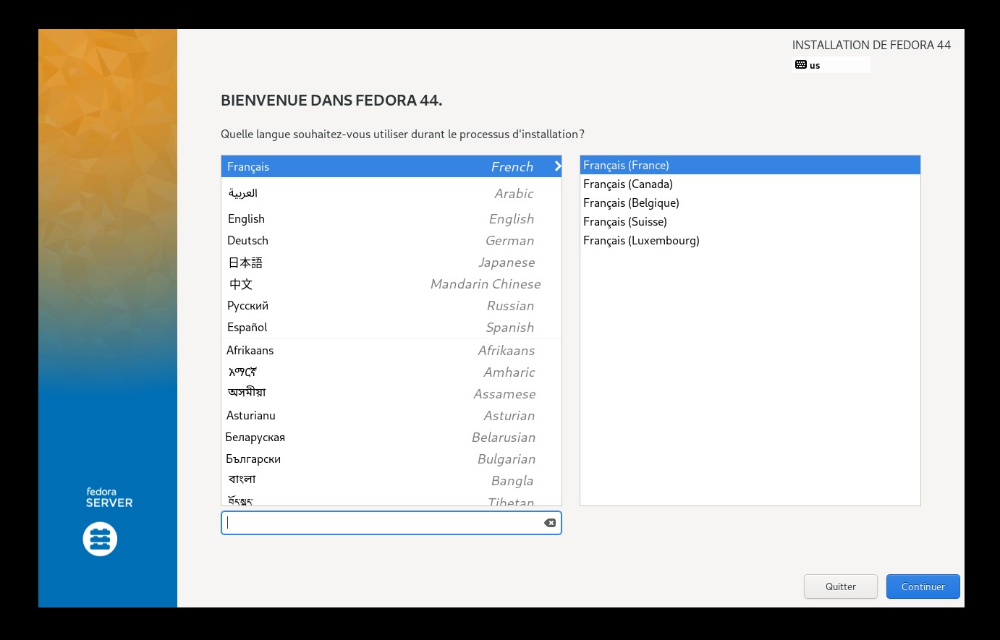
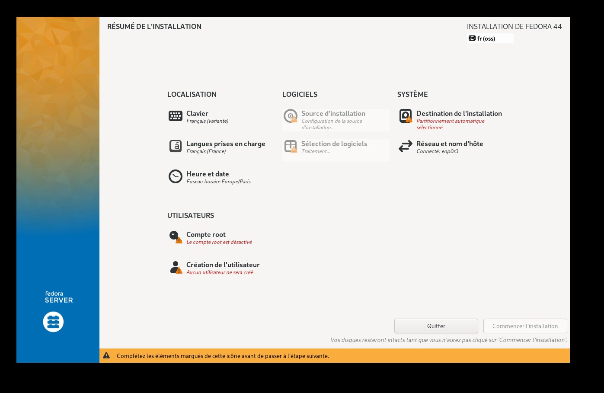
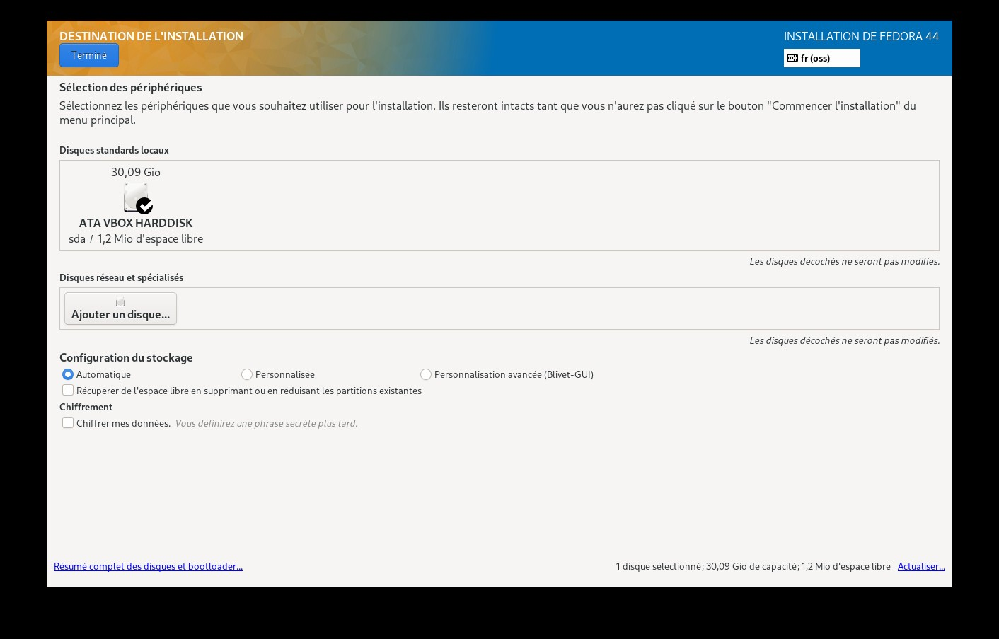
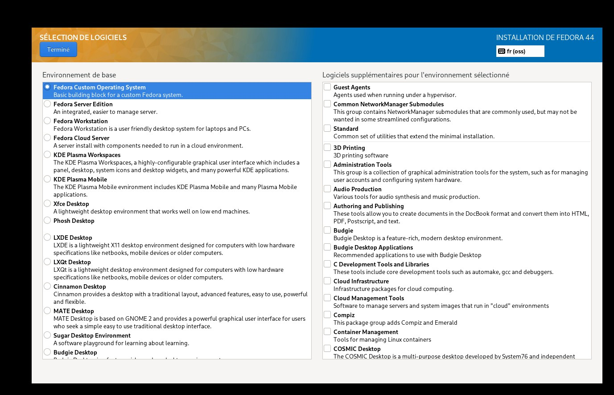
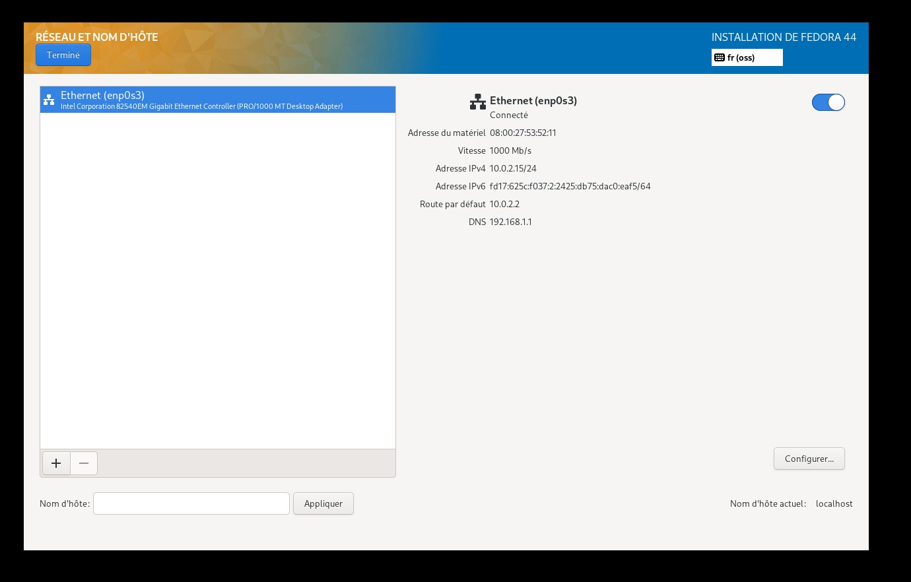
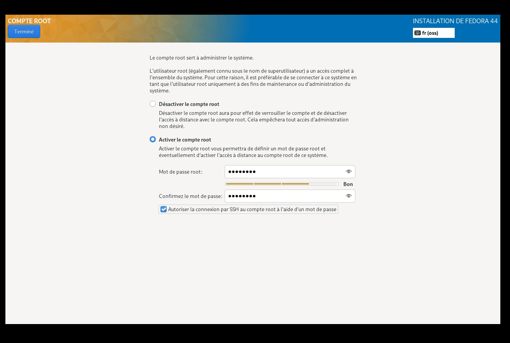
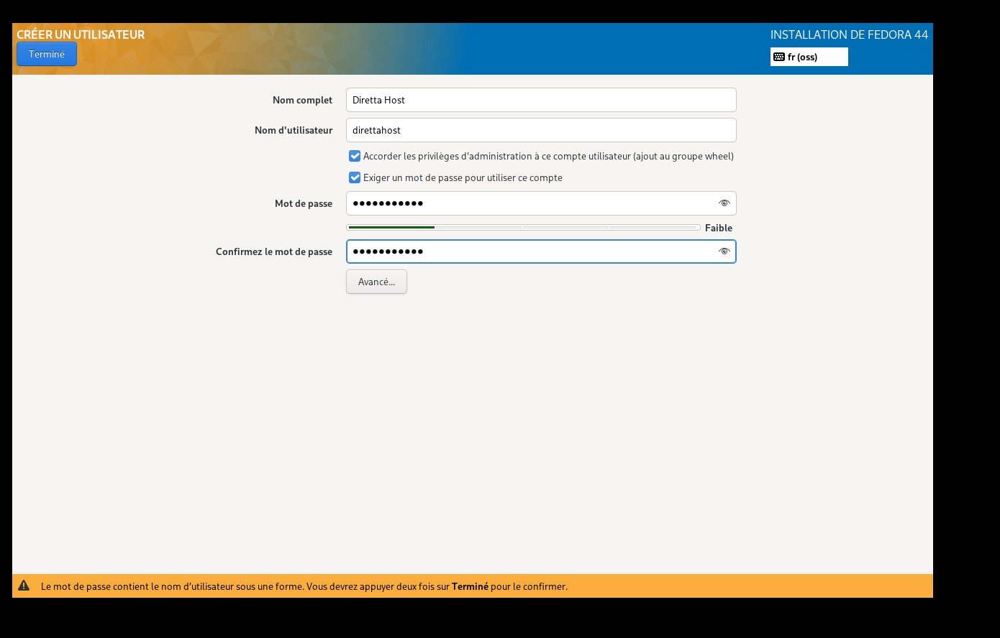

<!-- Translated from EN docs v0.1 — last sync: 2026-05-15 -->

# Guide pas à pas pour débutant — Fedora 43/44 + installation audiophile, à partir de zéro

Ce guide vous emmène d'un PC vide jusqu'à un hôte de lecture audiophile entièrement réglé, exécutant [DirettaRendererUPnP](https://github.com/cometdom/DirettaRendererUPnP) et/ou [slim2Diretta](https://github.com/cometdom/slim2Diretta). Aucune expérience Linux préalable n'est requise — chaque étape donne la commande exacte à taper.

**Temps nécessaire :** environ 2 à 3 heures au total. L'essentiel est la compilation du noyau + FFmpeg + DRUP, qui tourne sans surveillance.

**Ce que vous aurez à la fin :** un PC ou mini-PC sans écran dédié à la lecture audio, avec un noyau temps réel, des cœurs CPU isolés, de l'Ethernet jumbo vers votre DAC Diretta, et un renderer audio (UPnP et/ou LMS) qui apparaît simplement sur votre réseau pour être piloté par votre point de contrôle.

## Table des matières

- [Avant de commencer](#avant-de-commencer)
- **Partie A — à la machine (écran, clavier, souris)**
  - [1. Choisir le bon matériel](#1-choisir-le-bon-matériel)
  - [2. Réglages BIOS](#2-réglages-bios)
  - [3. Télécharger l'ISO Fedora](#3-télécharger-liso-fedora)
  - [4. Créer la clé USB de démarrage](#4-créer-la-clé-usb-de-démarrage)
  - [5. Installer Fedora minimal](#5-installer-fedora-minimal)
  - [6. Noter l'adresse IP](#6-noter-ladresse-ip)
- **Partie B — depuis votre canapé (SSH)**
  - [7. Se connecter en SSH](#7-se-connecter-en-ssh)
  - [8. Installer les prérequis](#8-installer-les-prérequis)
  - [9. Télécharger le SDK Diretta](#9-télécharger-le-sdk-diretta)
  - [10. Transférer le SDK](#10-transférer-le-sdk)
  - [11. Cloner l'assistant et le lancer](#11-cloner-lassistant-et-le-lancer)
  - [12. Parcourir le menu de l'assistant](#12-parcourir-le-menu-de-lassistant)
  - [13. Répondre aux questions des modules](#13-répondre-aux-questions-des-modules)
  - [14. Redémarrer](#14-redémarrer)
- **Partie C — après le redémarrage**
  - [15. Vérifier que tout tourne](#15-vérifier-que-tout-tourne)
  - [16. Premier test d'écoute](#16-premier-test-découte)
  - [17. Dépannage](#17-dépannage)
- [Référence rapide (TL;DR)](#référence-rapide-tldr)

---

## Avant de commencer

Il vous faut :

- Un **PC ou mini-PC** (Intel NUC, petit boîtier AMD, etc.) — x86_64, au moins 8 Go de RAM (16–32 Go recommandés) et 30 Go de disque libre. L'architecture ARM n'est pas prise en charge par cet assistant.
- Un **second ordinateur** (votre portable/poste principal) pour préparer la clé USB puis vous connecter en SSH.
- Une **clé USB**, 8 Go minimum. Son contenu sera effacé.
- Un **câble Ethernet** relié à votre réseau domestique — le Wi-Fi est déconseillé pour du streaming audio soutenu.
- (Optionnel mais recommandé pour le meilleur lien Diretta) **Une seconde carte réseau** dédiée au lien Diretta — un adaptateur USB-Ethernet à puce **Realtek RTL8156** est le choix de référence et le seul moyen de pousser le MTU jusqu'à 16128 (le meilleur compromis sinon est le jumbo 9014, géré par toute carte récente).
- Une **cible Diretta / DAC** sur votre réseau audio (c'est vers elle que l'hôte audio diffusera).
- L'adresse IP ou un accès admin à votre **box / routeur** (pour retrouver l'IP de l'hôte audio plus tard).
- **Environ 1 heure de patience** pendant l'étape de compilation FFmpeg + DRUP en [§13](#13-répondre-aux-questions-des-modules).

---

# Partie A — à la machine

Vous aurez besoin d'un écran, d'un clavier et d'une souris branchés sur l'hôte audio pour cette partie. Après le [§6](#6-noter-ladresse-ip), vous pourrez les débrancher et finir à distance.

## 1. Choisir le bon matériel

Une configuration type :

- **PC audio** : petit mini-PC sans ventilateur. Intel NUC, ASRock DeskMini, Beelink, Minisforum — n'importe quel boîtier x86_64 récent avec au moins 4 cœurs. **8 Go de RAM est le strict minimum ; 16–32 Go sont recommandés** (l'assistant tourne sans souci en 8 Go, mais la marge aide le noyau à garder le flux musical en cache et évite qu'une tâche dnf/mise à jour en arrière-plan n'écrive sur le disque pendant la lecture).
- **Stockage** : un SSD interne suffit largement — 60 à 120 Go sont plus que suffisants. Les fichiers musicaux ne résident pas ici ; ils sont sur votre serveur LMS/Minimserver/Roon ou en streaming depuis Qobuz/Tidal…
- **Deux cartes réseau (optionnel mais idéal)** : une pour votre LAN (points de contrôle, internet), une pour un lien point à point direct vers la cible Diretta. Pour le lien Diretta, un **adaptateur USB-Ethernet à puce Realtek RTL8156** est le choix de référence — c'est aussi la seule famille de cartes qui prend en charge le MTU **16128** (les autres cartes récentes plafonnent au jumbo 9014, ce qui convient à la plupart des configurations). Branchez-le sur un port **USB 3.0** (le bleu, ou marqué « SS »), pas USB 2.0. Si vous avez un emplacement PCIe libre dans votre PC, vous pouvez y mettre une carte PCIe à puce **Realtek RTL8156**.

Les configurations à une seule carte réseau fonctionnent aussi — l'assistant gère ce cas automatiquement.

## 2. Réglages BIOS

Ces choix sont importants, et certains ne peuvent plus être changés une fois le système installé. Entrez dans le BIOS / l'UEFI (généralement en appuyant sur **F2**, **F12**, **Suppr** ou **Échap** juste après l'allumage).

- **Secure Boot : DÉSACTIVÉ** — obligatoire. Le noyau temps réel installé par cet assistant ne peut pas être signé, donc Secure Boot l'empêcherait de démarrer.
- **C-states CPU : DÉSACTIVÉS** (ou « C0/C1 uniquement ») — empêche le CPU d'entrer en sommeil profond, source de latence.
- **CPU SpeedStep / Cool'n'Quiet / P-states : DÉSACTIVÉS** — maintient le CPU à fréquence maximale.
- **Turbo Boost : à votre convenance** — le laisser activé convient ; le système figera no_turbo au démarrage.
- **Hyper-Threading / SMT : ACTIVÉ** — laissez-le activé ; l'assistant peut le désactiver à l'exécution si vous le souhaitez.
- **Virtualisation (VT-x / AMD-V) : DÉSACTIVÉE** — inutile pour la lecture.
- **Puce audio de la carte mère : DÉSACTIVÉE** si vous ne l'utilisez jamais (l'audio sort par le réseau, pas par un DAC local).
- **Wake-on-LAN, IPMI, gestion serveur : DÉSACTIVÉS** sauf si vous en avez besoin.

Enregistrez, quittez et laissez la machine redémarrer.

## 3. Télécharger l'ISO Fedora

Sur votre **ordinateur principal** (pas le PC audio) :

1. Ouvrez https://fedoraproject.org/server/download dans votre navigateur.
2. Choisissez **Network Install** (netinst) pour **x86_64**.
3. Enregistrez le fichier. Son nom ressemble à `Fedora-Server-netinst-x86_64-44-*.iso` (ou `-43-` si vous choisissez délibérément Fedora 43 — l'assistant gère les deux).

> Pourquoi netinst et pas l'image Live ? L'image Live installe une quantité de logiciels que vous retireriez ensuite. Le netinst permet de partir d'une base réellement minimale.

## 4. Créer la clé USB de démarrage

L'outil multiplateforme le plus simple est **balenaEtcher**.

1. Téléchargez balenaEtcher depuis https://etcher.balena.io et installez-le sur votre ordinateur principal.
2. Branchez votre clé USB sur votre ordinateur principal.
3. Lancez balenaEtcher.
4. Cliquez sur **Flash from file** → sélectionnez l'ISO Fedora téléchargée.
5. Cliquez sur **Select target** → choisissez votre clé USB. **Vérifiez trois fois** — tout ce qui est pointé sera effacé.
6. Cliquez sur **Flash!** et attendez la fin de l'opération et sa vérification.


Éjectez proprement la clé USB une fois terminé.

## 5. Installer Fedora minimal

Branchez la clé USB sur le PC audio, plus l'écran, le clavier, la souris et le câble Ethernet vers votre LAN.

1. Allumez le PC audio et appuyez immédiatement sur la touche du **menu de démarrage** (souvent **F12**, **F11** ou **Échap** selon le fabricant).
2. Choisissez la clé USB dans le menu de démarrage. L'installeur Fedora (appelé Anaconda) se lance.
3. Après quelques secondes, l'écran **Bienvenue dans Fedora** apparaît. Cliquez sur **Installer Fedora**.


### 5.1 Langue et clavier

Choisissez **Français (France)** et la disposition de clavier correspondante. Cliquez sur **Terminé**.



Vous voyez maintenant le **Résumé de l'installation** — le tableau de bord depuis lequel vous configurez chaque section. Vous y reviendrez entre chaque étape ci-dessous.



### 5.2 Destination de l'installation

Cliquez sur **Destination de l'installation**.

- Sélectionnez le SSD interne (PAS la clé USB — la clé est la source de l'installeur).
- Configuration du stockage : **Automatique**.
- Cliquez sur **Terminé**. Si une confirmation est demandée, acceptez.



### 5.3 Sélection de logiciels (CRITIQUE)

Cliquez sur **Sélection de logiciels**.

- Environnement de base : **Système d'exploitation personnalisé Fedora** (*Fedora Custom Operating System*) — c'est l'étape la plus importante de tout l'installeur ; tout autre choix installe des logiciels qu'il faudrait retirer ensuite.
- **NE cochez AUCUN** groupe additionnel à droite.
- Cliquez sur **Terminé**.



### 5.4 Réseau et nom d'hôte

Cliquez sur **Réseau et nom d'hôte**.

- Basculez l'interface Ethernet sur **Activé** (elle devrait obtenir une adresse DHCP de votre box).
- Définissez un nom d'hôte mémorisable, p. ex. `audio-pc` ou `diretta-renderer`.
- Cliquez sur **Terminé**.



### 5.5 Mot de passe administrateur (root)

Cliquez sur **Mot de passe administrateur**.

- Cochez **Activer le compte administrateur**.
- Définissez un mot de passe root robuste. Vous ne l'utiliserez pas souvent, mais il sera utile en cas d'urgence.
- Cochez **Autoriser la connexion SSH de root par mot de passe** pour pouvoir dépanner la machine à distance si besoin.
- Cliquez sur **Terminé**.



### 5.6 Compte utilisateur

Cliquez sur **Création d'utilisateur**.

- Nom complet : ce que vous voulez.
- Nom d'utilisateur : court et en minuscules, p. ex. `dommusic`. C'est le compte que vous utiliserez au quotidien.
- Cochez **Faire de cet utilisateur un administrateur** (cela met l'utilisateur dans le groupe `wheel` et lui permet d'utiliser `sudo`).
- Définissez un mot de passe. Cliquez sur **Terminé**.



### 5.7 Lancer l'installation + redémarrer

De retour sur le Résumé de l'installation, cliquez sur **Commencer l'installation**.

L'installeur télécharge et écrit les paquets — cela prend 5 à 15 minutes selon votre réseau. Une fois terminé, cliquez sur **Redémarrer le système**.

**Retirez la clé USB** pendant que la machine redémarre, pour qu'elle ne redémarre pas sur l'installeur.

Après le redémarrage, la machine affiche une invite de connexion. Connectez-vous avec le compte **utilisateur** que vous avez créé (pas root).

## 6. Noter l'adresse IP

Dans le terminal :

```bash
ip addr show
```

Cherchez une ligne du type `inet 192.168.1.104/24` sous votre interface Ethernet (p. ex. `enp5s0`). Notez cette adresse — vous vous y connecterez en SSH ensuite.

Assurez-vous ensuite que SSH tourne sur le PC audio. Pendant que vous avez encore une session locale sur le PC audio, lancez :

```bash
sudo dnf install -y openssh-server
sudo systemctl enable --now sshd
```
Vous pouvez maintenant débrancher l'écran, le clavier et la souris du PC audio. Passez à votre ordinateur principal.

---

# Partie B — depuis votre canapé

Tout ce qui suit se fait en SSH depuis votre ordinateur principal.

## 7. Se connecter en SSH

Depuis votre **ordinateur principal** (Terminal sur Mac/Linux, PowerShell sur Windows 10+) :

```bash
ssh dommusic@192.168.1.104
```

Remplacez `dommusic` par le nom d'utilisateur créé en [§5.6](#56-compte-utilisateur) et `192.168.1.104` par l'IP du [§6](#6-noter-ladresse-ip). La première fois, tapez `yes` pour accepter la clé d'hôte, puis saisissez le mot de passe.

Vous devriez voir une invite du type `[dommusic@audio-pc ~]$`. Vous êtes connecté.

## 8. Installer les prérequis

Une installation Fedora minimale ne contient presque rien. Mettez le système à jour et installez les quelques outils dont l'assistant dépend :

```bash
sudo dnf -y update
sudo dnf -y install git curl mokutil grubby dnf-plugins-core
```

- `git` est nécessaire pour cloner le dépôt de l'assistant (et DRUP, slim2Diretta).
- Les autres sont utilisés par l'assistant lui-même ; si vous en oubliez, `00-preflight` les installera comme filet de sécurité.

## 9. Télécharger le SDK Diretta

Le SDK Diretta Host est requis pour compiler DRUP et slim2Diretta. **Il doit être téléchargé à la main** car sa licence n'autorise qu'un usage personnel.

Sur votre **ordinateur principal** (pas le PC audio) :

1. Ouvrez https://www.diretta.link/hostsdk.html dans votre navigateur.
2. Téléchargez la dernière archive **DirettaHostSDK**. Le nom de fichier ressemble à `DirettaHostSDK_149_8.tar.zst`.

Conservez le fichier dans un dossier facile à retrouver — vous le copierez sur le PC audio ensuite.

## 10. Transférer le SDK

Depuis votre **ordinateur principal** (ouvrez une nouvelle fenêtre Terminal/PowerShell — gardez votre session SSH ouverte dans l'autre) :

```bash
scp ~/Downloads/DirettaHostSDK_149_8.tar.zst dommusic@192.168.1.104:~/
```

Adaptez le chemin, le nom d'utilisateur et l'IP à votre système. Le fichier est copié dans le dossier personnel de l'utilisateur sur le PC audio.

Puis, de retour dans la **session SSH** sur le PC audio :

```bash
cd ~
tar --zstd -xf DirettaHostSDK_149_8.tar.zst
ls -d DirettaHostSDK_*
```

Vous devriez voir un dossier nommé `DirettaHostSDK_149` (ou similaire) dans votre dossier personnel. L'assistant le détecte automatiquement à partir de là.

## 11. Cloner l'assistant et le lancer

Toujours dans la session SSH :

```bash
cd ~
git clone https://github.com/cometdom/fedora-audiophile-setup.git
cd fedora-audiophile-setup
sudo ./setup.sh
```

Au premier lancement, un menu numéroté apparaît.

## 12. Parcourir le menu de l'assistant

```
What do you want to do?

   1) Full install         all modules in order (recommended)
   2) preflight            — verify hard pre-conditions...
   3) kernel-rt            — install the PREEMPT_RT kernel...
   ...
  14) finalize             — sanity-check + offer reboot
  15) Exit

Choose [1]:
```

Appuyez simplement sur **Entrée** (ou tapez `1`). L'assistant exécute tous les modules dans l'ordre. Des questions vous seront posées en chemin — la section suivante explique chacune d'elles.

> Si vous devez relancer un seul module (p. ex. vous avez sauté DRUP la première fois), vous pouvez soit choisir son numéro dans ce menu, soit utiliser le raccourci : `sudo ./setup.sh --only kernel-rt`.

## 13. Répondre aux questions des modules

Pour chaque question, la **valeur par défaut** (entre crochets, du type `[Y/n]` ou `[y/N]`) est ce qui se produit si vous appuyez juste sur Entrée. La lettre en majuscule est le défaut.

| Module | Question | Réponse recommandée |
|---|---|---|
| 02 system-tuning | `Use the -nosmt tuner variant?` | **N** (Entrée) — gardez l'Hyper-Threading activé ; le système épingle quand même correctement les threads audio. |
| 03 network-stack | `K) Keep NetworkManager / S) Switch to systemd-networkd / N) Skip` | **K** (Entrée) — garder NetworkManager est plus sûr pour une première installation. |
| 04 tmpfs-disk | `Mount /var/log and /var/tmp as tmpfs?` | **Y** (Entrée) — zéro écriture disque pendant la lecture. |
| 05 services-cleanup | `Disable firewalld?` | **Y** (Entrée) — hôte audio dédié sur un LAN de confiance. |
| 05 services-cleanup | `Disable SELinux?` | **Y** (Entrée) — aucun surcoût. |
| 10 install-drup | `Install DirettaRendererUPnP?` | **Y** si vous voulez UPnP / Audirvana / Roon / mConnect. Sinon **n**. |
| 10 install-drup | Choix de la carte réseau | Choisissez la carte reliée à votre cible Diretta. L'autre (celle qui a une IP) est votre côté LAN. |
| 10 install-drup | `Build DRUP with Clang + LTO?` | **Y** (Entrée) — meilleure qualité audio, compilation un peu plus longue. |
| 10 install-drup | Question `Configure firewall?` propre à DRUP | **N** — vous avez désactivé firewalld à l'étape 05. Répondre Y ici interromprait le script. |
| 10 install-drup | Question MTU de DRUP | **9014** (jumbo, défaut) sur la plupart des cartes. Choisissez **16128** uniquement si vous avez un adaptateur Realtek RTL8156 ET que votre cible Diretta gère aussi 16128. |
| 11 install-slim2diretta | `Install slim2Diretta?` | **Y** si vous diffusez depuis LMS / Lyrion Music Server. Sinon **n**. |
| 11 install-slim2diretta | `LMS server IP?` | Laissez vide pour l'auto-découverte, ou tapez l'IP du serveur LMS. |
| 99 finalize | `Reboot now?` | **N** (Entrée) au premier passage — vérifions ce qui est installé avant de redémarrer. |

L'étape de loin la plus longue est **10 install-drup** : elle compile FFmpeg depuis les sources. Comptez ~30 minutes pendant lesquelles l'écran défile avec beaucoup de coches vertes. C'est normal.

## 14. Redémarrer

Une fois l'assistant terminé et après avoir parcouru le récapitulatif `[OK] / [--]` qu'affiche le module finalize, redémarrez :

```bash
sudo reboot
```

Attendez 1 à 2 minutes, puis reconnectez-vous en SSH (même commande qu'au [§7](#7-se-connecter-en-ssh)).

---

# Partie C — après le redémarrage

## 15. Vérifier que tout tourne

```bash
uname -r
```

La sortie doit contenir `rt`, par exemple `6.x.x-rt`. Cela confirme que le noyau temps réel est bien utilisé.

```bash
cat /proc/cmdline
```

Cherchez des mots comme `isolcpus`, `nohz_full`, `rcu_nocbs` — ce sont les options d'isolation CPU ajoutées à GRUB par le tuner DRUP.

```bash
systemctl status diretta-renderer
```

(ignorez ceci si vous n'avez pas installé DRUP) — vous devriez voir `Active: active (running)`. Idem pour `systemctl status slim2diretta` si vous l'avez installé.

```bash
ip link show
```

Repérez votre carte Diretta (celle choisie à l'étape 10) et confirmez que son MTU est `9014` (ou la valeur choisie).

En cas de problème, voir le [§17 Dépannage](#17-dépannage) ci-dessous.

## 16. Premier test d'écoute

### Si vous avez installé DirettaRendererUPnP

Sur votre téléphone, tablette ou ordinateur (même réseau), utilisez un point de contrôle UPnP :

- **Audirvana** (Mac / Windows / Linux)
- **JPlay** (iOS)
- **mConnect** (iOS / Android)
- **BubbleUPnP** (Android)
- **Tune Server** (Mac / Windows / Linux)

Cherchez un appareil nommé **Diretta Renderer** (ou ce que vous avez défini comme `NAME` dans `/etc/default/diretta-renderer`). Choisissez un morceau et lancez la lecture.

### Si vous avez installé slim2Diretta

Dans la page d'administration de votre serveur LMS / Lyrion Music Server, le PC audio apparaît comme un nouveau lecteur nommé `slim2diretta` (ou le nom choisi). Choisissez-le comme cible de lecture.
slim2Diretta fonctionne aussi avec Roon, en activant le mode Squeezebox dans Roon.

Le premier son devrait atteindre votre cible Diretta / DAC en moins d'une seconde.

## 17. Dépannage

### « Impossible de se connecter en SSH après le redémarrage »

- Attendez 2 à 3 minutes — le premier démarrage sur le nouveau noyau est plus lent que d'habitude.
- Essayez de pinguer le nom d'hôte : `ping audio-pc.local` (ou le nom d'hôte que vous avez défini).
- Si vous avez plusieurs cartes réseau, l'IP côté LAN a pu changer ; vérifiez la page d'admin de votre box.

### « Le service DRUP ne tourne pas »

```bash
sudo systemctl status diretta-renderer
sudo journalctl -u diretta-renderer -n 50
```

Les causes les plus fréquentes :
- **`INTERFACE` incorrect dans `/etc/default/diretta-renderer`** — ce doit être la carte côté LAN (côté points de contrôle), pas la carte Diretta.
- **Aucune cible Diretta trouvée** — vérifiez que la cible est allumée et sur le même réseau que votre carte Diretta.

Modifiez la configuration :

```bash
sudo nano /etc/default/diretta-renderer
sudo systemctl restart diretta-renderer
```

### « L'adaptateur USB-Ethernet n'est pas détecté »

```bash
lsusb
dmesg | tail -30
ip link
```

Si l'adaptateur est dans `lsusb` mais pas dans `ip link`, il vous faut peut-être un pilote — voir le script `usb-ethernet_driver_install.sh` dans le dépôt DRUP, sous `~/DirettaRendererUPnP/`.

### « Le MTU n'a pas tenu »

```bash
nmcli connection show
nmcli connection show "diretta-<votre-iface>"
```

Regardez `802-3-ethernet.mtu`. S'il est à `auto`, définissez-le manuellement :

```bash
sudo nmcli connection modify "diretta-<votre-iface>" 802-3-ethernet.mtu 9014
sudo nmcli connection up "diretta-<votre-iface>"
```

### « L'assistant s'est interrompu en cours de route »

Relancez-le. Chaque module est idempotent — les changements déjà appliqués sont détectés et sautés. Pour ne relancer qu'un seul module :

```bash
sudo ./setup.sh --only <nom-du-module>
```

Par exemple : `sudo ./setup.sh --only install-drup`.

---

# Référence rapide (TL;DR)

Pour quand vous voudrez tout refaire de mémoire :

```bash
# === Partie A : à la machine ===
# (Installer Fedora 43 ou 44 Server netinst, installation minimale — voir §5.)

# === Partie B : SSH depuis votre ordinateur principal ===

# Sur le PC audio, après le premier démarrage, installer ssh et noter l'IP :
sudo dnf install -y openssh-server
sudo systemctl enable --now sshd
ip addr show

# Depuis votre ordinateur principal :
ssh dommusic@<ip-du-pc-audio>

# Dans la session SSH :
sudo dnf -y update
sudo dnf -y install git curl mokutil grubby dnf-plugins-core

# Télécharger le SDK Diretta depuis https://www.diretta.link/hostsdk.html
# Le transférer depuis votre ordinateur principal :
#   scp DirettaHostSDK_*.tar.zst dommusic@<ip-du-pc-audio>:~/

# De retour dans la session SSH :
cd ~
tar --zstd -xf DirettaHostSDK_*.tar.zst
git clone https://github.com/cometdom/fedora-audiophile-setup.git
cd fedora-audiophile-setup
sudo ./setup.sh
# Choisir l'option 1 (Full install). Répondre aux questions comme au §13.

# === Partie C : après le redémarrage ===
sudo reboot
# Attendre, se reconnecter en SSH, puis vérifier :
uname -r                          # doit contenir 'rt'
cat /proc/cmdline                 # doit contenir isolcpus / nohz_full
systemctl status diretta-renderer # si DRUP installé
systemctl status slim2diretta     # si slim2Diretta installé
```

Bonne écoute.
